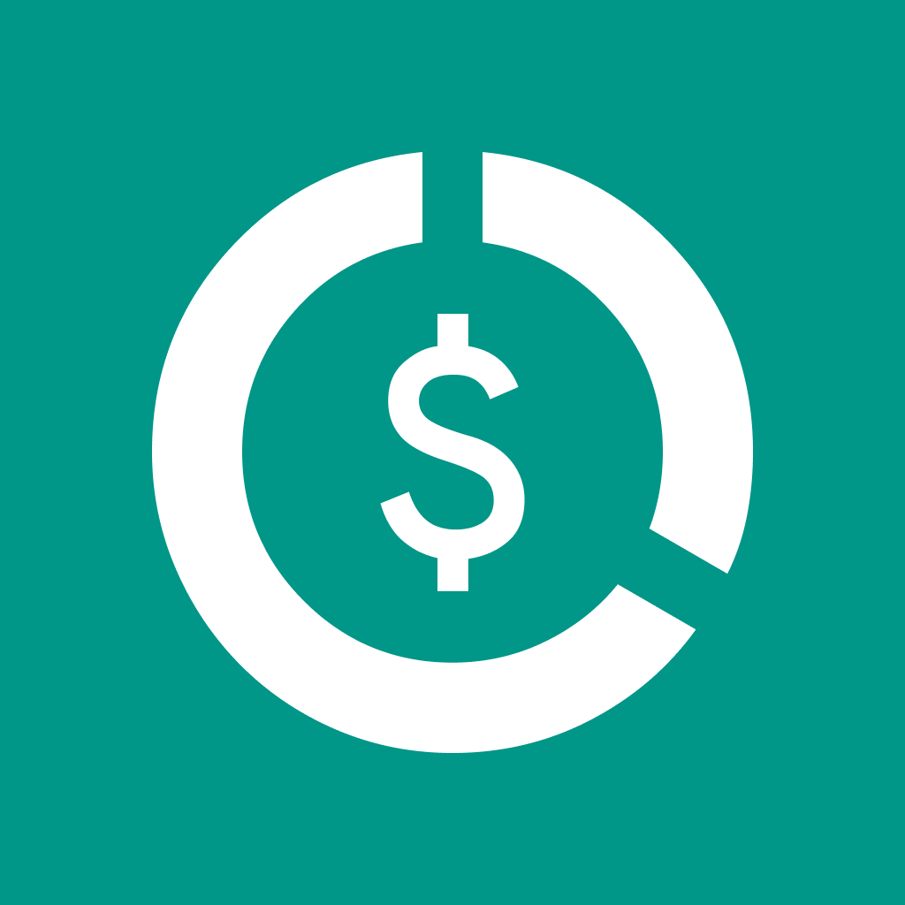
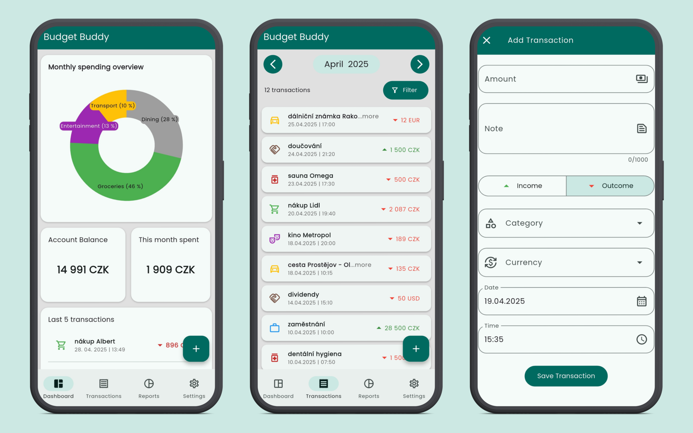
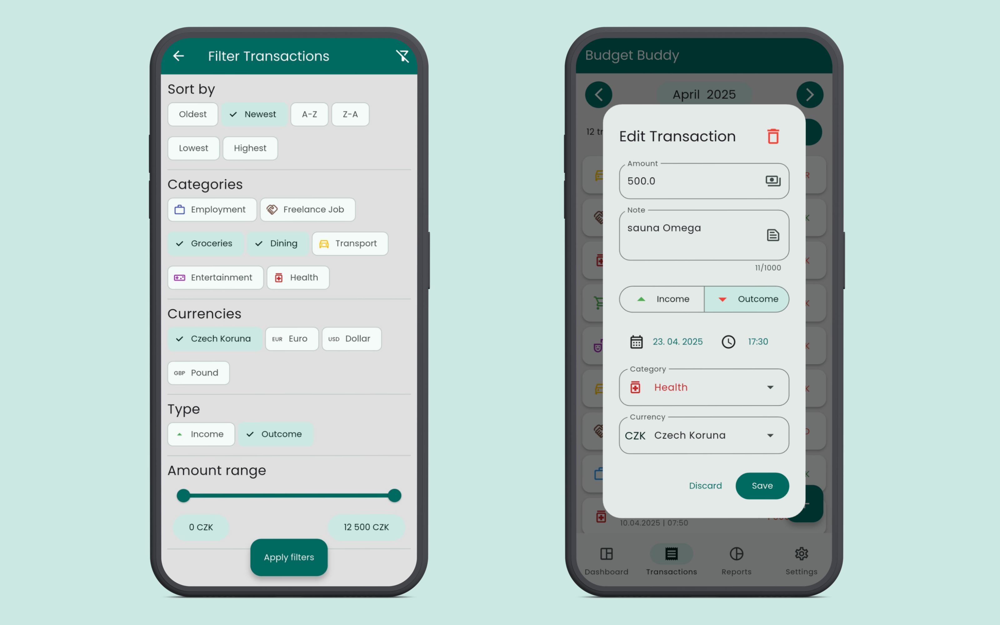
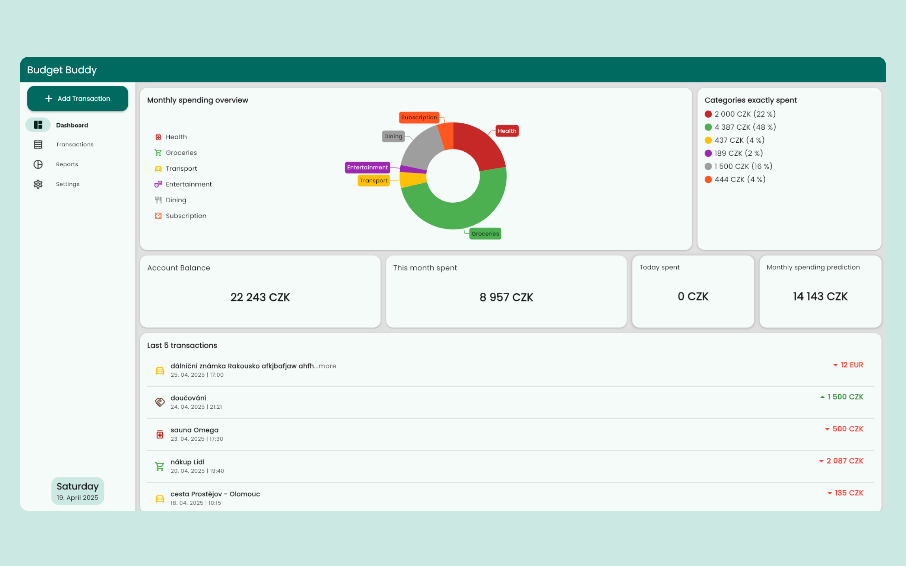
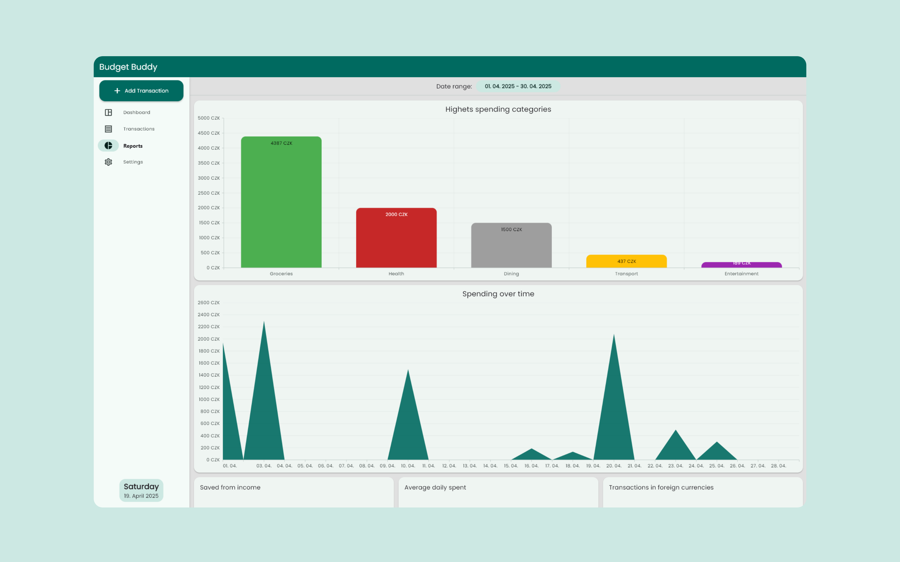

# Budget Buddy
> author: Vojtěch Netrh, contact: vojtanetrh@gmail.com

Budget Buddy is a simple finance management app for individual. It was made as my bachelor thesis (under leading of [Associate Professor Jan Konečný](http://phoenix.inf.upol.cz/~konecnyj)) on Palacký University in Olomouc. Main topic of this thesis was aimed on cross-platform framewrok - in my case it was Flutter. Because Flutter is made by Google I decied to use Material Design 3 as a design system. In my opinion using Material Design on more platforms than home Android is correct (Google does this also with their apps). More of the text part can be read in the thesis, which has it's own [repository](https://github.com/Nert53/bachelor-thesis)

## Installation
This part is different than the description for the school purposes that can be found in separete [text file](README.txt). 

### Web (only as example)
- TODO later ⏳

### Android
1. Download the `APK` file from the release section.
2. Enable installation from unknown sources in your device settings.
3. Open the downloaded `APK` file and follow the installation instructions.
4. Enjoy the app!

### Windows
1. Download the `EXE` file from the release section.
2. Run the installer and follow the installation instructions.
3. Enjoy the app!

### Other platforms
Other platforms like iOS, Linux and macOS should work fine, but the app was not tested on these platforms. To run the app on these platforms, you need to clone the repository and run the app using Flutter. Make sure you have Flutter and other tools installed ([Flutter website](https://flutter.dev/docs/get-started/install)).

## Screenshots
<figure>
  <figcaption>App icon</figcaption>
  
</figure>
<figure>
  <figcaption>Mobile - dashboard, transactions, add transaction</figcaption>
  
</figure>
<figure>
  <figcaption>Mobile - filters, edit transaction</figcaption>
  
</figure>
<figure>
  <figcaption>Desktop dashboard</figcaption>
  
</figure>
<figure>
  <figcaption>Desktop reports</figcaption>
  
</figure>
